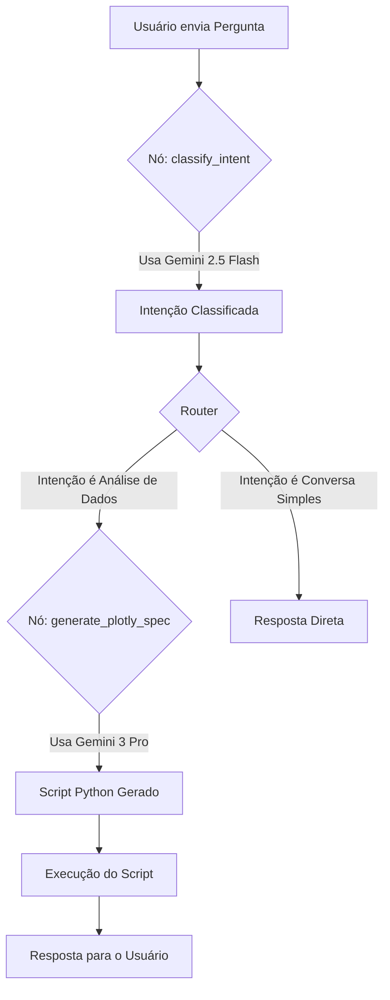

# Documentação: Estratégia de Modelos Híbridos de IA

## 1. Introdução

Este documento detalha a arquitetura e a implementação de uma estratégia de **modelos de IA híbridos** para o agente de Business Intelligence. O objetivo é otimizar a relação **custo-benefício** e a **performance** da aplicação, utilizando o modelo de linguagem (LLM) mais adequado para cada tipo de tarefa.

A abordagem consiste em usar um modelo mais rápido e econômico para tarefas simples e de alto volume, e um modelo mais poderoso e de última geração para tarefas complexas que exigem máxima precisão.

## 2. Estratégia Geral

A lógica do agente foi dividida em duas etapas principais, cada uma atendida por um modelo Gemini específico:

| Etapa do Agente | Tarefa Principal | Modelo Recomendado | Justificativa |
| :--- | :--- | :--- | :--- |
| **Classificação de Intenção** | Entender a pergunta do usuário e roteá-la para o fluxo correto. | **Gemini 2.5 Flash** | **Eficiência.** Custo muito baixo e alta velocidade para uma tarefa de classificação relativamente simples. |
| **Geração de Código/Análise** | Criar scripts Python (`Pandas`, `Plotly`) para análise de dados e visualização. | **Gemini 3 Pro** | **Qualidade Máxima.** Garante a maior precisão na tarefa mais crítica e complexa do projeto, que é a geração de código funcional. |

---

## 3. Pontos de Implementação

A seguir, os detalhes técnicos das modificações necessárias no código para implementar esta estratégia.

### 3.1. `core/config/settings.py` - Centralização da Configuração

Para evitar nomes de modelos "hardcoded" e facilitar futuras atualizações, os identificadores dos modelos devem ser centralizados neste arquivo.

**Ação:** Adicionar as seguintes variáveis ao seu arquivo de `settings.py`:

```python
# Em core/config/settings.py

from pydantic_settings import BaseSettings

class Settings(BaseSettings):
    # ... outras configurações existentes ...

    # Nomes dos modelos de IA para a estratégia híbrida
    INTENT_CLASSIFICATION_MODEL: str = "models/gemini-2.5-flash"
    CODE_GENERATION_MODEL: str = "models/gemini-3-pro"

    # Temperaturas recomendadas para cada tarefa
    INTENT_CLASSIFICATION_TEMPERATURE: float = 0.0
    CODE_GENERATION_TEMPERATURE: float = 0.2
```

### 3.2. `core/factory/component_factory.py` - Fábrica de Componentes

O `ComponentFactory` é modificado para ser capaz de fornecer diferentes instâncias de LLM com base na tarefa.

**Ação:** Atualizar a fábrica para ler as configurações e fornecer o LLM correto.

```python
# Em core/factory/component_factory.py

from functools import lru_cache
from core.llm_adapter import LLMAdapter
from core.config.settings import get_settings # Supondo que você tenha uma função para obter as configs

class ComponentFactory:
    
    @lru_cache(maxsize=4) # Cache para evitar recriar instâncias idênticas
    def get_llm_adapter(self, model_name: str, temperature: float) -> LLMAdapter:
        """
        Retorna uma instância do LLMAdapter configurada para um modelo e temperatura específicos.
        """
        settings = get_settings()
        # A lógica real para inicializar o cliente da API do Google AI estaria aqui
        return LLMAdapter(
            api_key=settings.google_api_key, 
            model_name=model_name, 
            temperature=temperature
        )

    def get_intent_classification_llm(self) -> LLMAdapter:
        """Retorna o LLM para tarefas de classificação de intenção."""
        settings = get_settings()
        return self.get_llm_adapter(
            model_name=settings.INTENT_CLASSIFICATION_MODEL,
            temperature=settings.INTENT_CLASSIFICATION_TEMPERATURE
        )

    def get_code_generation_llm(self) -> LLMAdapter:
        """Retorna o LLM para tarefas de geração de código."""
        settings = get_settings()
        return self.get_llm_adapter(
            model_name=settings.CODE_GENERATION_MODEL,
            temperature=settings.CODE_GENERATION_TEMPERATURE
        )
```

### 3.3. `core/agents/bi_agent_nodes.py` - Nós do Agente

Os nós do agente são atualizados para solicitar e usar a instância correta do LLM vinda da fábrica.

**Ação:** Modificar as funções dos nós para chamar os novos métodos do `ComponentFactory`.

```python
# Em core/agents/bi_agent_nodes.py

from core.factory.component_factory import ComponentFactory

# A fábrica pode ser instanciada aqui ou injetada (ver melhores práticas)
_factory = ComponentFactory()

def classify_intent(state: AgentState) -> dict:
    """Classifica a intenção do usuário usando o LLM apropriado."""
    llm = _factory.get_intent_classification_llm() # << MUDANÇA AQUI
    
    # ...lógica do prompt para classificação...
    # response = llm.generate_content(prompt)
    
    return {"intent": "..."}


def generate_plotly_spec(state: AgentState) -> dict:
    """Gera o script de análise e visualização usando o LLM de alta capacidade."""
    llm = _factory.get_code_generation_llm() # << MUDANÇA AQUI

    # ...lógica do prompt complexo para geração de código...
    # response = llm.generate_content(prompt)

    return {"plotly_spec": "..."}
```

---

## 4. Melhores Práticas e Considerações

- **Injeção de Dependência:** Para facilitar os testes unitários dos nós, considere "injetar" a instância da fábrica em vez de criá-la globalmente no módulo.
- **Tratamento de Erros:** Uma implementação de produção deve incluir lógica de `try...except` e, possivelmente, um mecanismo de *fallback* (tentar com um modelo secundário se a chamada ao principal falhar).

## 5. Fluxo de Dados

O diagrama abaixo ilustra o fluxo de uma consulta do usuário através do sistema híbrido.



## 6. Conclusão

A implementação desta estratégia híbrida otimiza os custos operacionais da aplicação, ao mesmo tempo que maximiza a qualidade e a precisão nas tarefas mais críticas, garantindo uma experiência de usuário robusta e confiável. A arquitetura permanece modular e fácil de manter.
