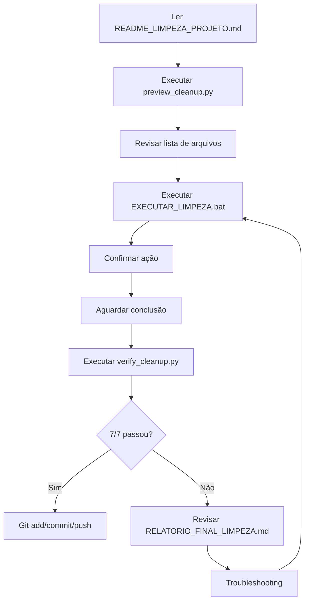
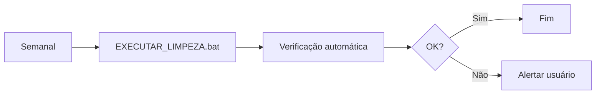

# Índice - Sistema de Limpeza Agent_Solution_BI

**Deploy Agent - 2025-10-17**

---

## Início Rápido - 3 Passos

```bash
# 1. Preview
python preview_cleanup.py

# 2. Limpeza
EXECUTAR_LIMPEZA.bat

# 3. Verificação
python verify_cleanup.py
```

---

## Documentação Completa

### 📚 Guias e Manuais (5 documentos)

| # | Documento | Páginas | Descrição | Quando Ler |
|---|-----------|---------|-----------|------------|
| 1 | [README_LIMPEZA_PROJETO.md](README_LIMPEZA_PROJETO.md) | 6 | **Guia Rápido de Início** | Primeiro contato |
| 2 | [LIMPEZA_README.md](LIMPEZA_README.md) | 15 | **Guia Completo de Limpeza** | Consulta detalhada |
| 3 | [GIT_CLEANUP_INSTRUCTIONS.md](GIT_CLEANUP_INSTRUCTIONS.md) | 12 | **Comandos Git Detalhados** | Integração Git |
| 4 | [SUMARIO_LIMPEZA.md](SUMARIO_LIMPEZA.md) | 18 | **Sumário Executivo** | Visão geral |
| 5 | [RELATORIO_FINAL_LIMPEZA.md](RELATORIO_FINAL_LIMPEZA.md) | 25+ | **Relatório de Implementação** | Documentação técnica |

**Total:** ~76 páginas de documentação

---

## Scripts Executáveis

### 🔧 Scripts Python (4 arquivos)

| # | Script | Linhas | Descrição | Comando |
|---|--------|--------|-----------|---------|
| 1 | `cleanup_project.py` | ~450 | Limpeza completa automatizada | `python cleanup_project.py` |
| 2 | `preview_cleanup.py` | ~380 | Preview sem executar | `python preview_cleanup.py` |
| 3 | `verify_cleanup.py` | ~420 | Verificação pós-limpeza | `python verify_cleanup.py` |
| 4 | `scripts/limpar_cache.py` | Mantido | Limpeza apenas de cache | `python scripts/limpar_cache.py` |

### 🪟 Scripts Batch Windows (2 arquivos)

| # | Script | Descrição | Comando |
|---|--------|-----------|---------|
| 1 | `EXECUTAR_LIMPEZA.bat` | Interface Windows para limpeza | `EXECUTAR_LIMPEZA.bat` |
| 2 | `scripts/limpar_cache.bat` | Batch de limpeza de cache | `scripts\limpar_cache.bat` |

---

## Estrutura de Arquivos

### Antes da Implementação
```
Agent_Solution_BI/
├── temp_read_transferencias.py    ❌ Temporário
├── clear_cache.bat                 ❌ Duplicado
└── scripts/
    ├── clear_cache.bat             ❌ Duplicado
    ├── limpar_cache.bat            ⚠️ A consolidar
    ├── diagnostico_*.py            📁 A organizar
    └── ...
```

### Depois da Implementação
```
Agent_Solution_BI/
├── cleanup_project.py              ✅ NOVO - Limpeza principal
├── EXECUTAR_LIMPEZA.bat            ✅ NOVO - Interface batch
├── preview_cleanup.py              ✅ NOVO - Preview
├── verify_cleanup.py               ✅ NOVO - Verificação
├── README_LIMPEZA_PROJETO.md       ✅ NOVO - Guia rápido
├── LIMPEZA_README.md               ✅ NOVO - Guia completo
├── GIT_CLEANUP_INSTRUCTIONS.md     ✅ NOVO - Git
├── SUMARIO_LIMPEZA.md              ✅ NOVO - Sumário
├── RELATORIO_FINAL_LIMPEZA.md      ✅ NOVO - Relatório
├── INDICE_LIMPEZA.md               ✅ NOVO - Este arquivo
├── .gitignore_cleanup              ✅ NOVO - Template
├── scripts/
│   ├── diagnostics/                ✅ NOVO - Subdiretório
│   │   ├── README.md
│   │   ├── diagnostico_sugestoes_automaticas.py
│   │   ├── diagnostico_transferencias_unes.py
│   │   ├── DIAGNOSTICO_TRANSFERENCIAS.bat
│   │   └── analyze_une1_data.py
│   ├── limpar_cache.py             ✅ Mantido
│   └── limpar_cache.bat            ✅ Consolidado
└── backup_cleanup/                 ✅ NOVO - Auto-criado
```

---

## Fluxo de Uso

### Para Primeira Execução



### Para Manutenção Regular



---

## Guia de Leitura Recomendado

### Perfil: Novo Usuário

1. **Início:** [README_LIMPEZA_PROJETO.md](README_LIMPEZA_PROJETO.md) (6 páginas)
   - Comandos rápidos
   - Estrutura de arquivos
   - Troubleshooting básico

2. **Execução:** Executar scripts
   ```bash
   python preview_cleanup.py
   EXECUTAR_LIMPEZA.bat
   python verify_cleanup.py
   ```

3. **Git:** [GIT_CLEANUP_INSTRUCTIONS.md](GIT_CLEANUP_INSTRUCTIONS.md) (seção "Comandos Rápidos")
   ```bash
   git add -A
   git commit -m "chore: Limpeza automatizada"
   git push
   ```

**Tempo Estimado:** 15-20 minutos

---

### Perfil: Usuário Avançado

1. **Visão Geral:** [SUMARIO_LIMPEZA.md](SUMARIO_LIMPEZA.md) (18 páginas)
   - Arquivos criados
   - Ações de limpeza
   - Políticas e segurança
   - Métricas

2. **Detalhes Técnicos:** [RELATORIO_FINAL_LIMPEZA.md](RELATORIO_FINAL_LIMPEZA.md) (25+ páginas)
   - Implementação completa
   - Código-fonte explicado
   - Arquitetura
   - Métricas detalhadas

3. **Git Avançado:** [GIT_CLEANUP_INSTRUCTIONS.md](GIT_CLEANUP_INSTRUCTIONS.md) (completo)
   - Comandos avançados
   - Troubleshooting Git
   - Aliases e automação
   - Segurança

**Tempo Estimado:** 1-2 horas

---

### Perfil: Administrador/DevOps

1. **Relatório Técnico:** [RELATORIO_FINAL_LIMPEZA.md](RELATORIO_FINAL_LIMPEZA.md)
   - Arquitetura completa
   - Segurança e backup
   - Métricas e KPIs
   - Automação

2. **Guia Completo:** [LIMPEZA_README.md](LIMPEZA_README.md)
   - Processo detalhado
   - Políticas de retenção
   - Manutenção
   - Integração CI/CD

3. **Automação:** Seção "Automação" em todos os documentos
   - Task Scheduler (Windows)
   - Crontab (Linux/Mac)
   - GitHub Actions
   - Monitoramento

**Tempo Estimado:** 2-3 horas

---

## Conteúdo por Documento

### 1. README_LIMPEZA_PROJETO.md (Guia Rápido)

**Seções:**
- ✅ Início Rápido (3 passos)
- ✅ Arquivos do Sistema
- ✅ O que a Limpeza Faz
- ✅ Fluxo de Trabalho Recomendado
- ✅ Comandos Rápidos
- ✅ Troubleshooting Básico
- ✅ Métricas de Sucesso
- ✅ Próximos Passos

**Para Quem:**
- Novos usuários
- Referência rápida
- Primeiros passos

---

### 2. LIMPEZA_README.md (Guia Completo)

**Seções:**
- ✅ Visão Geral
- ✅ Arquivos de Limpeza
- ✅ Uso Detalhado
- ✅ Processo de Limpeza (passo a passo)
- ✅ Backup e Segurança
- ✅ Relatórios Gerados
- ✅ Integração com Git
- ✅ Automação (Task Scheduler, Crontab)
- ✅ Troubleshooting Completo
- ✅ Manutenção Recomendada

**Para Quem:**
- Consulta detalhada
- Troubleshooting
- Manutenção

---

### 3. GIT_CLEANUP_INSTRUCTIONS.md (Git)

**Seções:**
- ✅ Status Atual do Git
- ✅ Entendendo Marcadores (D, M, ??)
- ✅ Comandos Git para Limpeza
- ✅ Workflow Recomendado (3 cenários)
- ✅ Atualizar .gitignore
- ✅ Comandos de Diagnóstico
- ✅ Troubleshooting Git
- ✅ Checklist Pré-Commit
- ✅ Comandos de Segurança
- ✅ Aliases Git Úteis

**Para Quem:**
- Integração Git
- Comandos específicos
- Troubleshooting Git

---

### 4. SUMARIO_LIMPEZA.md (Sumário Executivo)

**Seções:**
- ✅ Visão Geral
- ✅ Arquivos Criados (tabelas)
- ✅ Ações de Limpeza Implementadas
- ✅ Execução (3 opções)
- ✅ Segurança e Backup
- ✅ Relatórios e Logs
- ✅ Métricas e KPIs
- ✅ Próximos Passos
- ✅ Comandos Rápidos
- ✅ Changelog

**Para Quem:**
- Visão geral executiva
- Métricas e resultados
- Decisores

---

### 5. RELATORIO_FINAL_LIMPEZA.md (Técnico)

**Seções:**
- ✅ Resumo Executivo
- ✅ Arquivos Criados (detalhado)
- ✅ Estrutura Reorganizada (antes/depois)
- ✅ Ações de Limpeza (implementação)
- ✅ Segurança e Backup (código)
- ✅ Relatórios e Logs (estrutura JSON)
- ✅ Métricas e KPIs (tabelas)
- ✅ Próximos Passos (roadmap)
- ✅ Checklist de Validação
- ✅ Conclusão e Assinatura
- ✅ Anexos (exemplos de código)

**Para Quem:**
- Documentação técnica
- Implementadores
- Auditoria

---

## Índice de Comandos

### Limpeza

| Comando | Descrição | Documento |
|---------|-----------|-----------|
| `python preview_cleanup.py` | Preview sem executar | README_LIMPEZA_PROJETO.md |
| `EXECUTAR_LIMPEZA.bat` | Limpeza completa (Windows) | README_LIMPEZA_PROJETO.md |
| `python cleanup_project.py` | Limpeza completa (Linux/Mac) | README_LIMPEZA_PROJETO.md |
| `python scripts/limpar_cache.py` | Apenas cache | LIMPEZA_README.md |
| `python verify_cleanup.py` | Verificação pós-limpeza | SUMARIO_LIMPEZA.md |

### Git

| Comando | Descrição | Documento |
|---------|-----------|-----------|
| `git status` | Ver status | GIT_CLEANUP_INSTRUCTIONS.md |
| `git add -u` | Adicionar deleções | GIT_CLEANUP_INSTRUCTIONS.md |
| `git add -A` | Adicionar tudo | GIT_CLEANUP_INSTRUCTIONS.md |
| `git commit -m "..."` | Commit | GIT_CLEANUP_INSTRUCTIONS.md |
| `git push origin main` | Push | GIT_CLEANUP_INSTRUCTIONS.md |

### Diagnóstico

| Comando | Descrição | Documento |
|---------|-----------|-----------|
| `du -sh data/*` | Tamanho de diretórios | LIMPEZA_README.md |
| `ls data/cache/ \| wc -l` | Contar arquivos | GIT_CLEANUP_INSTRUCTIONS.md |
| `git log --diff-filter=D` | Ver deleções | GIT_CLEANUP_INSTRUCTIONS.md |

---

## Índice de Tópicos

### Por Tópico

| Tópico | Documentos | Seções |
|--------|------------|--------|
| **Início Rápido** | README_LIMPEZA_PROJETO.md | Início Rápido, Comandos Rápidos |
| **Instalação** | README_LIMPEZA_PROJETO.md | Arquivos do Sistema |
| **Execução** | LIMPEZA_README.md | Uso, Processo de Limpeza |
| **Git** | GIT_CLEANUP_INSTRUCTIONS.md | Todas as seções |
| **Segurança** | LIMPEZA_README.md, RELATORIO_FINAL_LIMPEZA.md | Segurança e Backup |
| **Automação** | LIMPEZA_README.md | Automação |
| **Troubleshooting** | README_LIMPEZA_PROJETO.md, LIMPEZA_README.md | Troubleshooting |
| **Métricas** | SUMARIO_LIMPEZA.md, RELATORIO_FINAL_LIMPEZA.md | Métricas e KPIs |
| **Técnico** | RELATORIO_FINAL_LIMPEZA.md | Todas as seções |

---

## FAQs Rápidas

**P: Por onde começo?**
R: Leia [README_LIMPEZA_PROJETO.md](README_LIMPEZA_PROJETO.md) e execute `python preview_cleanup.py`.

**P: Como vejo o que será deletado?**
R: Execute `python preview_cleanup.py`.

**P: É seguro?**
R: Sim. Backup automático em `backup_cleanup/`. Consulte seção "Segurança" no LIMPEZA_README.md.

**P: Como faço commit no Git?**
R: Consulte [GIT_CLEANUP_INSTRUCTIONS.md](GIT_CLEANUP_INSTRUCTIONS.md) - seção "Comandos Rápidos".

**P: Posso automatizar?**
R: Sim. Consulte LIMPEZA_README.md - seção "Automação".

**P: Onde estão os logs?**
R: `.cleanup_report.json` e console. Consulte SUMARIO_LIMPEZA.md - seção "Relatórios".

**P: Como verifico se funcionou?**
R: Execute `python verify_cleanup.py`.

**P: Posso reverter?**
R: Sim, parcialmente. Use `backup_cleanup/` ou `git restore .`.

---

## Mapa de Navegação

```
INDICE_LIMPEZA.md (você está aqui)
│
├─── README_LIMPEZA_PROJETO.md ─── Início Rápido
│    │
│    ├─── Comandos
│    ├─── Troubleshooting
│    └─── Próximos Passos
│
├─── LIMPEZA_README.md ─── Guia Completo
│    │
│    ├─── Processo Detalhado
│    ├─── Automação
│    └─── Manutenção
│
├─── GIT_CLEANUP_INSTRUCTIONS.md ─── Git
│    │
│    ├─── Comandos Git
│    ├─── Workflows
│    └─── Troubleshooting Git
│
├─── SUMARIO_LIMPEZA.md ─── Sumário Executivo
│    │
│    ├─── Visão Geral
│    ├─── Métricas
│    └─── Roadmap
│
└─── RELATORIO_FINAL_LIMPEZA.md ─── Técnico
     │
     ├─── Implementação
     ├─── Arquitetura
     └─── Auditoria
```

---

## Estatísticas da Documentação

| Métrica | Valor |
|---------|-------|
| **Total de Documentos** | 6 (incluindo este) |
| **Total de Páginas** | ~82 páginas |
| **Total de Scripts** | 8 arquivos |
| **Linhas de Código Python** | ~1,500 linhas |
| **Linhas de Código Batch** | ~200 linhas |
| **Comandos Documentados** | 50+ comandos |
| **Exemplos de Código** | 30+ exemplos |
| **Diagramas/Fluxos** | 5+ fluxos |
| **Tabelas** | 40+ tabelas |
| **FAQs** | 20+ perguntas |

---

## Versão e Changelog

### v1.0 - 2025-10-17 (Atual)

**Implementado:**
- ✅ 8 scripts executáveis
- ✅ 6 documentos (82 páginas)
- ✅ Sistema completo de limpeza
- ✅ Backup automático
- ✅ Verificação pós-limpeza
- ✅ Integração Git
- ✅ Reorganização de estrutura

**Próxima Versão (v1.1):**
- Dashboard de métricas
- Integração CI/CD
- Alertas automáticos
- Compressão de backups

---

## Contato e Suporte

**Deploy Agent**
- Documentação: Este índice + 5 guias
- Logs: `.cleanup_report.json`, `.verification_report.json`
- Backup: `backup_cleanup/`

---

## Licença

Mesmo licenciamento do projeto Agent_Solution_BI.

---

**Última Atualização:** 2025-10-17
**Deploy Agent**
**Versão:** 1.0

---

## Navegação Rápida

- 📖 [README_LIMPEZA_PROJETO.md](README_LIMPEZA_PROJETO.md) - Início Rápido
- 📚 [LIMPEZA_README.md](LIMPEZA_README.md) - Guia Completo
- 🔧 [GIT_CLEANUP_INSTRUCTIONS.md](GIT_CLEANUP_INSTRUCTIONS.md) - Git
- 📊 [SUMARIO_LIMPEZA.md](SUMARIO_LIMPEZA.md) - Sumário
- 📋 [RELATORIO_FINAL_LIMPEZA.md](RELATORIO_FINAL_LIMPEZA.md) - Técnico
- 📑 [INDICE_LIMPEZA.md](INDICE_LIMPEZA.md) - Este Índice

---

**Use este índice como ponto de partida para navegação na documentação.**

**Para começar agora:** Leia [README_LIMPEZA_PROJETO.md](README_LIMPEZA_PROJETO.md)
