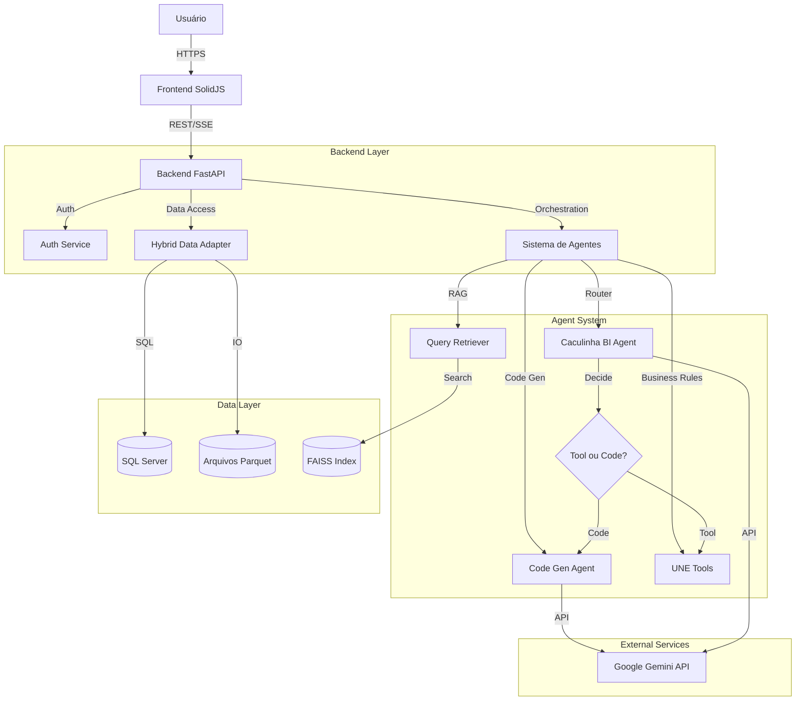

# Arquitetura do Sistema Agent Solution BI

Este documento descreve a arquitetura técnica do sistema Agent Solution BI após a migração para a stack SolidJS + FastAPI.

## 1. Visão Geral

O sistema segue uma arquitetura de **microserviços monolíticos**, onde o backend é uma aplicação FastAPI modularizada que serve como API Gateway, orquestrador de agentes e camada de acesso a dados, enquanto o frontend é uma Single Page Application (SPA) construída com SolidJS.

### Diagrama de Alto Nível

## 2. Componentes do Backend

### 2.1 API Layer (`app/api/v1`)
- **Endpoints**: Expostos via FastAPI.
- **Autenticação**: Dependência `get_current_active_user` valida tokens JWT.
- **Streaming**: Endpoint `/chat/stream` usa Server-Sent Events (SSE) para respostas em tempo real.

### 2.2 Core Layer (`app/core`)
- **Agents**:
    - `CaculinhaBIAgent`: Agente principal que interpreta a intenção do usuário e roteia para ferramentas específicas ou para geração de código.
    - `CodeGenAgent`: Especialista em gerar código Python (Polars) seguro para análise de dados ad-hoc. Implementa *Self-Healing* (auto-correção de erros).
- **Tools**:
    - `une_tools.py`: Implementa regras de negócio complexas da UNE (Unidade de Negócio), como cálculo de abastecimento, MC e validação de transferências.
- **RAG & Learning**:
    - `QueryRetriever`: Busca semântica de queries passadas usando `sentence-transformers` e `FAISS`.
    - `ExampleCollector`: Coleta exemplos de sucesso para realimentar o RAG.
- **Security**:
    - `input_validator.py`: Sanitização de entradas.
    - `data_masking.py`: Mascaramento de PII (CPF, Email) nas saídas.

### 2.3 Infrastructure Layer (`app/infrastructure`)
- **HybridDataAdapter**: Abstração que permite leitura de dados tanto de arquivos Parquet (alta performance para leitura analítica) quanto do SQL Server (dados transacionais/auth).
- **Database**: Modelos SQLAlchemy para persistência relacional.

## 3. Componentes do Frontend

### 3.1 UI Framework
- **SolidJS**: Escolhido pela performance superior (sem Virtual DOM) e reatividade fina (Signals).
- **TailwindCSS**: Estilização utilitária.

### 3.2 State Management
- **Stores**: Uso de `createStore` do SolidJS para gerenciamento de estado global (ex: `dashboard.ts`, `auth.ts`).

### 3.3 Comunicação
- **Axios**: Cliente HTTP para requisições REST padrão.
- **EventSource**: API nativa do navegador para consumo de SSE no chat.

### 3.4 Visualização
- **Plotly.js**: Renderização de gráficos interativos gerados pelo backend.

## 4. Fluxos de Dados Principais

### 4.1 Fluxo de Chat BI
1. Usuário envia mensagem no Frontend.
2. Frontend conecta em `/chat/stream` (SSE).
3. Backend autentica e instancia `CaculinhaBIAgent`.
4. Agente analisa a query:
    - Se for uma regra de negócio conhecida (ex: "abastecimento"), chama a ferramenta correspondente em `une_tools`.
    - Se for uma análise aberta (ex: "total de vendas por região"), chama `CodeGenAgent`.
5. `CodeGenAgent`:
    - Busca exemplos similares via RAG.
    - Gera código Python usando Gemini.
    - Executa o código em ambiente controlado.
    - Se houver erro, tenta corrigir (Self-Healing).
6. Resultado é formatado (Texto/Gráfico/Tabela) e enviado via stream para o Frontend.
7. Frontend renderiza os blocos de resposta incrementalmente.

### 4.2 Fluxo de Transferências
1. Usuário acessa Dashboard de Transferências.
2. Frontend solicita sugestões via API.
3. Backend executa algoritmo de sugestão em `une_tools` (baseado em rupturas e estoque excessivo).
4. Usuário valida ou cria solicitação manual.
5. Backend salva solicitação em JSON para processamento posterior.

## 5. Considerações de Segurança

- **Autenticação Híbrida**: Suporte a login local (SQL/Parquet) e integração com Supabase.
- **Execução de Código**: O código gerado é executado com escopo limitado, mas recomenda-se containerização para isolamento total em produção.
- **Sanitização**: Inputs são validados para prevenir Injection. Outputs são mascarados para proteger PII.
