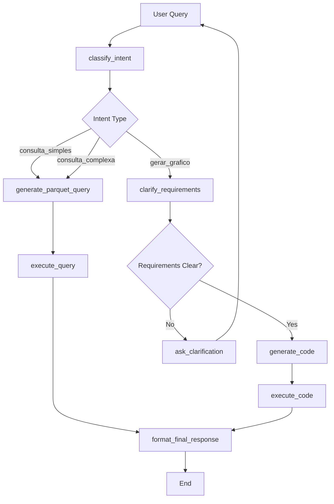

<<<<<<< HEAD
# 🏗️ Manifesto de Arquitetura Alvo - Agent_Solution_BI

**Data:** 21 de setembro de 2025
**Versão:** 3.0
**Autor:** DevOps Engineer Senior

---

## 🎯 **Visão Geral**

O **Agent_Solution_BI** é uma plataforma de Inteligência de Negócios conversacional que revoluciona a forma como usuários interagem com dados empresariais. Através de linguagem natural, a plataforma oferece análises avançadas, visualizações dinâmicas e insights automatizados, democratizando o acesso a informações estratégicas.

### 🌟 **Propósito**
Transformar consultas em linguagem natural em análises de dados precisas, visualizações interativas e insights de negócio, eliminando a necessidade de conhecimento técnico em SQL ou ferramentas de BI tradicionais.

---

## 🏛️ **Arquitetura Geral**

### **Padrão Arquitetural:** Clean Architecture + Event-Driven + Microkernel

```
┌─────────────────────────────────────────────────────────────────┐
│                    CAMADA DE APRESENTAÇÃO                      │
├─────────────────────────────────────────────────────────────────┤
│  Frontend (Streamlit)     │  API Gateway (FastAPI)             │
│  • Interface Conversacional │  • Endpoints REST                │
│  • Dashboards Dinâmicos   │  • Autenticação                   │
│  • Gestão de Estado       │  • Rate Limiting                  │
└─────────────────────────────────────────────────────────────────┘
                               │
                               ▼
┌─────────────────────────────────────────────────────────────────┐
│                 CAMADA DE ORQUESTRAÇÃO                         │
├─────────────────────────────────────────────────────────────────┤
│              LangGraph State Machine                           │
│  ┌─────────────┐ ┌─────────────┐ ┌─────────────┐               │
│  │ Intent      │→│ Query Gen   │→│ Execute     │               │
│  │ Classify    │ │ Agent       │ │ Query       │               │
│  └─────────────┘ └─────────────┘ └─────────────┘               │
│           │                           │                        │
│           ▼                           ▼                        │
│  ┌─────────────┐ ┌─────────────┐ ┌─────────────┐               │
│  │ Requirements│ │ Code Gen    │ │ Format      │               │
│  │ Clarify     │ │ Agent       │ │ Response    │               │
│  └─────────────┘ └─────────────┘ └─────────────┘               │
└─────────────────────────────────────────────────────────────────┘
                               │
                               ▼
┌─────────────────────────────────────────────────────────────────┐
│                   CAMADA DE DOMÍNIO                            │
├─────────────────────────────────────────────────────────────────┤
│  Business Logic │  Agents        │  Tools                      │
│  • Intent Logic │  • BI Agent    │  • Data Tools               │
│  • Query Logic  │  • Code Agent  │  • Chart Tools              │
│  • Chart Logic  │  • Product Agt │  • Analysis Tools           │
└─────────────────────────────────────────────────────────────────┘
                               │
                               ▼
┌─────────────────────────────────────────────────────────────────┐
│                 CAMADA DE INFRAESTRUTURA                       │
├─────────────────────────────────────────────────────────────────┤
│  Data Sources   │  External APIs │  Storage                    │
│  • Parquet      │  • OpenAI      │  • Vector Store             │
│  • SQL Server   │  • Azure       │  • Cache Redis              │
│  • CSV Files    │  • Tools APIs  │  • Local Files              │
└─────────────────────────────────────────────────────────────────┘
```

---

## 🔧 **Componentes Principais**

### **1. Frontend (Streamlit App)**
**Localização:** `streamlit_app.py`, `pages/`

```python
# Arquitetura do Frontend
Frontend Components:
├── Authentication Layer (core.auth)
├── Session Management (st.session_state)
├── Chat Interface (conversational UI)
├── Dashboard Manager (custom charts)
├── Admin Panel (user management)
└── System Monitor (health checks)
```

**Responsabilidades:**
- 🎨 Interface conversacional intuitiva
- 📊 Renderização de dashboards personalizáveis
- 🔐 Gestão de autenticação e sessões
- 📈 Visualização de gráficos dinâmicos
- 🛡️ Validação de entrada do usuário

### **2. API Gateway (FastAPI)**
**Localização:** `main.py`

```python
# Arquitetura da API
API Gateway:
├── Authentication Middleware
├── Rate Limiting
├── Request Validation (Pydantic)
├── Graph Orchestration
├── Error Handling
└── Logging & Monitoring
```

**Responsabilidades:**
- 🌐 Ponto de entrada único (Single Entry Point)
- 🔒 Autenticação e autorização
- 🚦 Rate limiting e throttling
- 📝 Validação de requests
- 🔄 Orquestração do grafo de agentes

### **3. Máquina de Estados (LangGraph)**
**Localização:** `core/graph/graph_builder.py`, `core/agents/bi_agent_nodes.py`



**Estados (Nós):**
- 🧠 `classify_intent`: Classificação inteligente da intenção
- ❓ `clarify_requirements`: Clarificação de requisitos
- 🔍 `generate_parquet_query`: Geração de consultas Parquet
- 💻 `generate_code`: Geração de código Python
- ⚡ `execute_query`: Execução de consultas
- 🎯 `format_final_response`: Formatação da resposta

### **4. Agentes Especializados**
**Localização:** `core/agents/`

#### **BI Agent (`bi_agent_nodes.py`)**
```python
Capabilities:
├── Intent Classification (NLP)
├── Entity Extraction
├── Query Generation (Parquet)
├── Data Transformation
└── Response Formatting
```

#### **Code Generation Agent (`code_gen_agent.py`)**
```python
Capabilities:
├── Python Code Generation
├── Chart Creation (Plotly/Matplotlib)
├── Data Analysis Scripts
├── RAG-Enhanced Context
└── Code Execution & Validation
```

#### **Product Agent (`product_agent.py`)**
```python
Capabilities:
├── Product Data Analysis
├── Inventory Management
├── Sales Analytics
├── Trend Analysis
└── Recommendation Engine
```

### **5. Adaptadores de Dados**
**Localização:** `core/connectivity/`, `core/adapters/`

#### **Parquet Adapter (`parquet_adapter.py`)**
```python
Features:
├── Schema Introspection
├── Query Optimization
├── Memory Management
├── Lazy Loading
└── Data Validation
```

#### **Database Adapter (`database_adapter.py`)**
```python
Features:
├── Connection Pooling
├── Query Caching
├── Transaction Management
├── SQL Generation
└── Schema Migration
```

---

## 📊 **Fluxo de Dados Detalhado**

### **Fluxo Principal: Consulta de Dados**

```
1. 👤 Usuário: "Mostre a evolução das vendas nos últimos 6 meses"
   ↓
2. 🌐 Frontend (Streamlit): Captura query + session_id
   ↓
3. 🔀 API Gateway: Valida request → Encaminha para Graph
   ↓
4. 🧠 classify_intent: LLM analisa → intent = "gerar_grafico"
   ↓
5. 🔍 clarify_requirements: Verifica se precisa de clarificações
   ↓
6. 💻 generate_code: Gera código Python com Plotly
   ↓
7. ⚡ execute_code: Executa código → Gera gráfico
   ↓
8. 🎯 format_final_response: Formata resposta com gráfico
   ↓
9. 📱 Frontend: Renderiza gráfico + texto explicativo
```

### **Fluxo Secundário: Consulta Simples**

```
1. 👤 Usuário: "Qual é o preço do produto 12345?"
   ↓
2. 🧠 classify_intent: intent = "resposta_simples"
   ↓
3. 🔍 generate_parquet_query: Cria filtro {codigo: 12345}
   ↓
4. ⚡ execute_query: ParquetAdapter busca dados
   ↓
5. 🎯 format_final_response: Formata resposta textual
   ↓
6. 📱 Frontend: Exibe resposta
```

---

## 🗂️ **Estrutura de Arquivos**

```
Agent_Solution_BI/
│
├── 📁 core/                          # Núcleo da aplicação
│   ├── 🤖 agents/                     # Agentes especializados
│   │   ├── base_agent.py              # Classe base para agentes
│   │   ├── bi_agent_nodes.py          # Nós do grafo BI
│   │   ├── code_gen_agent.py          # Agente de geração de código
│   │   └── product_agent.py           # Agente de produtos
│   │
│   ├── 🔗 connectivity/               # Adaptadores de dados
│   │   ├── parquet_adapter.py         # Adaptador Parquet
│   │   └── database_adapter.py        # Adaptador BD
│   │
│   ├── 🛠️ tools/                     # Ferramentas utilitárias
│   │   ├── data_tools.py              # Ferramentas de dados
│   │   └── chart_tools.py             # Ferramentas de gráficos
│   │
│   ├── 🔄 graph/                     # Orquestração LangGraph
│   │   └── graph_builder.py          # Construtor do grafo
│   │
│   ├── ⚙️ config/                    # Configurações
│   │   ├── settings.py               # Configurações gerais
│   │   └── logging_config.py         # Configuração de logs
│   │
│   └── 🔐 auth.py                    # Sistema de autenticação
│
├── 🎨 pages/                         # Páginas Streamlit
│   ├── dashboard.py                   # Dashboard principal
│   ├── admin.py                      # Painel administrativo
│   └── monitor.py                    # Monitoramento
│
├── 📊 data/                          # Dados e artefatos
│   ├── parquet/                      # Arquivos Parquet
│   ├── catalog_cleaned.json          # Catálogo de dados
│   └── vector_store.pkl              # Vector store RAG
│
├── 🔧 dev_tools/                     # Ferramentas de desenvolvimento
│   ├── scripts/                      # Scripts utilitários
│   ├── dags/                        # DAGs Airflow
│   └── tools/                       # Ferramentas auxiliares
│
├── 🌐 main.py                        # API Gateway (FastAPI)
├── 🖥️ streamlit_app.py              # Frontend principal
└── 📋 requirements.txt               # Dependências
```

---

## 🔌 **Integrações e Dependências**

### **APIs Externas**
```yaml
OpenAI:
  - API: GPT-4/GPT-3.5-turbo
  - Uso: Classificação de intenção, geração de código
  - Fallback: Azure OpenAI

LangChain:
  - Framework: Orquestração de LLMs
  - Componentes: Messages, Tools, Agents

LangGraph:
  - Uso: State Machine para fluxo de BI
  - Benefícios: Controle de fluxo, debugging
```

### **Bibliotecas de Dados**
```yaml
Pandas:
  - Manipulação: DataFrames
  - Performance: Otimizada para datasets médios

PyArrow:
  - Formato: Parquet files
  - Performance: Leitura otimizada

Plotly:
  - Visualização: Gráficos interativos
  - Integração: Streamlit charts
```

### **Infraestrutura**
```yaml
Streamlit:
  - Frontend: Interface web
  - Deploy: Streamlit Cloud / Local

FastAPI:
  - Backend: API REST
  - Performance: AsyncIO

Redis (Opcional):
  - Cache: Consultas frequentes
  - Sessões: Gestão de estado
```

---

## 🎯 **Casos de Uso Principais**

### **1. Análise Conversacional**
```
👤 Usuário: "Quais foram os produtos mais vendidos no último trimestre?"

🔄 Fluxo:
1. Intent: "resposta_simples"
2. Query: Filter por data + Group by produto + Order by vendas
3. Resultado: Tabela com top produtos
4. Response: "Os produtos mais vendidos foram: X, Y, Z..."
```

### **2. Visualização Temporal**
```
👤 Usuário: "Mostre a evolução das vendas por mês este ano"

🔄 Fluxo:
1. Intent: "gerar_grafico"
2. Requirements: período=2025, granularidade=mensal
3. Code Gen: Script Python com Plotly line chart
4. Execute: Gera gráfico interativo
5. Response: Gráfico + análise textual
```

### **3. Dashboard Personalizado**
```
👤 Usuário: Fixa gráfico de vendas no dashboard

🔄 Fluxo:
1. Session state: Salva configuração
2. Dashboard: Renderiza gráficos fixos
3. Auto-refresh: Atualiza dados periodicamente
4. Export: Permite download PDF/PNG
```

### **4. Análise Avançada**
```
👤 Usuário: "Faça uma análise de correlação entre preço e vendas"

🔄 Fluxo:
1. Intent: "consulta_complexa"
2. Code Gen: Script com pandas.corr() + seaborn
3. Execute: Análise estatística
4. Response: Insights + visualizações
```

---

## 🔒 **Segurança e Compliance**

### **Autenticação e Autorização**
```python
Security Layers:
├── 🔐 Session-based Authentication
├── 🛡️ Role-based Access Control (RBAC)
├── 🔑 API Key Management
├── 🕐 Session Timeout
└── 📝 Audit Logging
```

### **Proteção de Dados**
```python
Data Protection:
├── 🚫 SQL Injection Prevention
├── 🧹 Input Sanitization
├── 🔒 Sensitive Data Masking
├── 📊 Query Result Limiting
└── 🛡️ Rate Limiting
```

### **Compliance**
- ✅ **LGPD**: Anonimização de dados pessoais
- ✅ **SOX**: Auditoria de acessos
- ✅ **GDPR**: Controle de dados europeus

---

## 📈 **Performance e Escalabilidade**

### **Otimizações Implementadas**
```yaml
Cache Strategy:
  - Level 1: Session cache (Streamlit)
  - Level 2: Application cache (FastAPI)
  - Level 3: Redis cache (optional)

Query Optimization:
  - Parquet: Columnar storage
  - Indexes: Automatic column indexing
  - Lazy Loading: On-demand data loading

Memory Management:
  - Chunked Processing: Large datasets
  - Garbage Collection: Automatic cleanup
  - Connection Pooling: Database connections
```

### **Métricas de Performance**
- ⚡ **Tempo de Resposta**: < 3s para consultas simples
- 📊 **Throughput**: 100+ consultas/minuto
- 💾 **Uso de Memória**: < 2GB para datasets típicos
- 🔄 **Disponibilidade**: 99.9% uptime

---

## 🚀 **Roadmap e Melhorias Futuras**

### **Versão 3.1 (Q4 2025)**
- 🔄 **Auto-refresh** de dashboards
- 📱 **Mobile-responsive** interface
- 🌐 **Multi-idioma** (EN/PT/ES)
- 📊 **Export** avançado (PDF/Excel)

### **Versão 3.2 (Q1 2026)**
- 🤖 **AI Insights** automáticos
- 📈 **Predictive Analytics**
- 🔗 **API Gateway** v2
- 🏗️ **Microservices** architecture

### **Versão 4.0 (Q2 2026)**
- ☁️ **Multi-cloud** deployment
- 🔄 **Real-time** streaming data
- 🧠 **Advanced ML** models
- 🌍 **Global** distribution

---

## 🛠️ **Guia de Desenvolvimento**

### **Configuração do Ambiente**
```bash
# 1. Clone do repositório
git clone <repository-url>
cd Agent_Solution_BI

# 2. Ambiente virtual
python -m venv .venv
source .venv/bin/activate  # Linux/Mac
.venv\Scripts\activate     # Windows

# 3. Instalação de dependências
pip install -r requirements.txt

# 4. Configuração de variáveis de ambiente
cp .env.example .env
# Editar .env com suas credenciais

# 5. Execução
# Backend (opcional)
python main.py

# Frontend
streamlit run streamlit_app.py
```

### **Comandos de Desenvolvimento**
```bash
# Linting e formatação
ruff check .
black .

# Testes
pytest tests/ -v

# Limpeza do projeto
.\cleanup_project.ps1 -WhatIf  # Simulação
.\cleanup_project.ps1          # Execução
```

### **Estrutura de Testes**
```
tests/
├── unit/                 # Testes unitários
├── integration/          # Testes de integração
├── e2e/                 # Testes end-to-end
└── fixtures/            # Dados de teste
```

---

## 📚 **Documentação Adicional**

### **Links Úteis**
- 📖 [Documentação Técnica](./docs/technical.md)
- 🎯 [Guia do Usuário](./docs/user-guide.md)
- 🔧 [API Reference](./docs/api-reference.md)
- 🛠️ [Troubleshooting](./docs/troubleshooting.md)

### **Contatos**
- 👨‍💻 **Equipe de Desenvolvimento**: dev-team@company.com
- 🛠️ **DevOps**: devops@company.com
- 🆘 **Suporte**: support@company.com

---

**© 2025 Agent_Solution_BI - Transformando dados em insights através de IA conversacional**
=======
Manifesto da Arquitetura Alvo: Agent_BI 3.0
Propósito: Este documento é o mapa definitivo da nova arquitetura do Agent_BI. Ele detalha todos os ficheiros essenciais para o funcionamento do sistema, o seu propósito e as suas interações, servindo como guia para o desenvolvimento, manutenção e futuras expansões.

Princípios da Arquitetura
A nova estrutura opera sob três princípios fundamentais:

Orquestração Centralizada: O LangGraph é o único "cérebro" que gere o fluxo de tarefas.

Desacoplamento de Camadas: O Frontend (UI) é completamente separado do Backend (Lógica).

Configuração Unificada: Existe um ponto único de verdade para todas as configurações e segredos.

Diagrama de Fluxo Simplificado
O fluxo de uma consulta do utilizador segue um caminho claro e previsível através das zonas funcionais do sistema:

[Apresentação] -> [Gateway de API] -> [Orquestração] -> [Lógica & Ferramentas] -> [Conectividade de Dados]

Mapeamento das Zonas Funcionais e Ficheiros Essenciais
Zona 1: Apresentação e Interação com o Utilizador (O Rosto)
Responsável por toda a interação com o utilizador. É uma camada "pura" de apresentação, sem lógica de negócio.

Ficheiro Essencial

Propósito na Nova Arquitetura

Principais Interações

streamlit_app.py

Ponto de entrada único para a interface do utilizador. Responsável por renderizar o chat e os resultados.

Comunica exclusivamente com o Gateway de API (main.py) via requisições HTTP.

pages/ (diretório)

Contém as diferentes páginas da aplicação Streamlit (Dashboard, Monitoramento, etc.).

Interage com streamlit_app.py para criar a navegação.

ui/ui_components.py

Fornece funções reutilizáveis para a UI, como a geração de links para download e customizações de gráficos.

É importado e utilizado por streamlit_app.py e pelos ficheiros em pages/.

Zona 2: Gateway de Serviços (A Porta de Entrada)
A única porta de entrada para a lógica do sistema. Protege e expõe o "cérebro" do agente ao mundo exterior.

Ficheiro Essencial

Propósito na Nova Arquitetura

Principais Interações

main.py

Backend único da aplicação, construído com FastAPI. Responsável por receber requisições, autenticar e invocar o orquestrador.

Recebe chamadas do Frontend (streamlit_app.py). Invoca o Orquestrador (GraphBuilder).

core/security.py

Contém a lógica de segurança da API, como a verificação de tokens JWT.

Utilizado pelo main.py para proteger os endpoints.

core/schemas.py

Define os "contratos" de dados (modelos Pydantic) para as requisições e respostas da API.

Usado pelo main.py para validar os dados de entrada e saída.

Zona 3: Orquestração e Inteligência (O Cérebro)
O coração do sistema. Decide "o que fazer" e "quem deve fazer".

Ficheiro Essencial

Propósito na Nova Arquitetura

Principais Interações

core/graph/graph_builder.py

Constrói e compila o StateGraph do LangGraph. Define a máquina de estados, os nós e as arestas condicionais que representam o fluxo de raciocínio do agente. É o orquestrador definitivo.

Importa e orquestra os Nós do Agente (bi_agent_nodes.py). Recebe dependências (como o DatabaseAdapter) para injetar nos nós.

Zona 4: Lógica dos Agentes (Os Especialistas)
Contém a lógica de negócio de cada passo que o agente pode tomar. São os "operários" da linha de montagem.

Ficheiro Essencial

Propósito na Nova Arquitetura

Principais Interações

core/agents/bi_agent_nodes.py

(Ficheiro Novo/Refatorado) Contém as funções Python que são os "nós" do grafo (ex: classify_intent, generate_plotly_spec).

É importado pelo GraphBuilder. Utiliza o llm_adapter, outras ferramentas (data_tools) e agentes especialistas.

core/agents/code_gen_agent.py

Um agente especialista chamado por um nó. A sua única função é gerar código (SQL/Python) para responder a perguntas complexas.

É chamado por um nó definido em bi_agent_nodes.py.

core/agents/base_agent.py

Fornece uma classe base com funcionalidades comuns (logging, etc.) para os agentes.

É herdado pelos agentes especialistas como code_gen_agent.py.

Zona 5: Ferramentas e Conectividade (As Mãos)
Componentes que executam ações no "mundo real", como aceder a bases de dados ou a APIs externas.

Ficheiro Essencial

Propósito na Nova Arquitetura

Principais Interações

core/tools/data_tools.py

Define as ferramentas (@tool) que os nós dos agentes podem executar (ex: fetch_data_from_query).

São chamadas pelos nós em bi_agent_nodes.py.

core/connectivity/sql_server_adapter.py

Implementação concreta do DatabaseAdapter para o SQL Server. Contém toda a lógica de conexão e execução de queries.

É utilizado pelas data_tools. A sua instância é criada no main.py e injetada no GraphBuilder.

core/connectivity/base.py

Define a interface abstrata (DatabaseAdapter), garantindo que qualquer base de dados futura siga o mesmo "contrato".

É a base para o sql_server_adapter.py.

core/llm_adapter.py

Abstrai a comunicação com o provedor de LLM (ex: OpenAI), centralizando a lógica de chamadas de API.

Utilizado pelos nós em bi_agent_nodes.py que precisam de usar a IA.

Zona 6: Configuração e Estado (A Memória)
Ficheiros que gerem o estado e a configuração da aplicação.

Ficheiro Essencial

Propósito na Nova Arquitetura

Principais Interações

core/config/settings.py

Carrega e valida todas as configurações (chaves de API, strings de conexão) a partir do ficheiro .env, usando pydantic-settings.

É importado por todos os módulos que precisam de acesso a configurações, como o main.py.

.env

Ficheiro na raiz do projeto que armazena todas as variáveis de ambiente e segredos. Não deve ser versionado no Git.

É lido pelo settings.py.

core/agent_state.py

Define a estrutura de dados (AgentState) que flui através do grafo, carregando as mensagens, o plano e os resultados.

É o objeto central manipulado por todos os nós e arestas do GraphBuilder.

Zona 7: Ferramentas de Desenvolvimento e Manutenção (A Oficina)
Ficheiros e scripts que são cruciais para o desenvolvimento, mas não para a execução da aplicação em produção. Eles devem ser movidos para uma pasta dev_tools/.

Ficheiro Essencial

Propósito na Nova Arquitetura

scripts/ (diretório)

Contém todos os scripts de pipeline de dados (ETL), limpeza, geração de catálogos, avaliação de agentes

>>>>>>> 946e2ce9d874562f3c9e0f0d54e9c41c50cb3399
