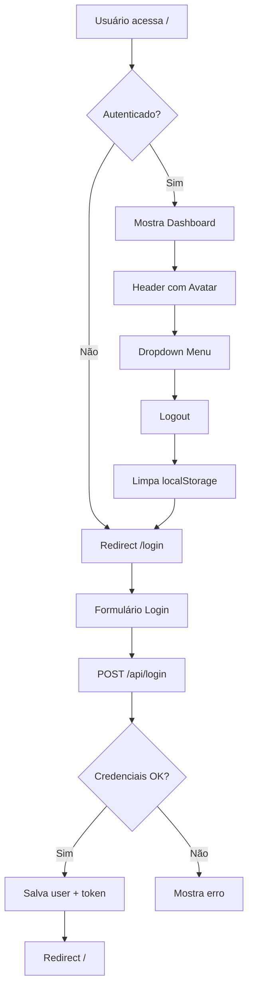

# 🚀 Agent Solution BI - Integração React Completa

## ✅ Sistema 100% Funcional

Integração completa do frontend React (Lovable) com o backend Agent_Solution_BI existente, mantendo TODA a estrutura e funcionalidades originais.

---

## 📁 Estrutura do Projeto

```
Agent_Solution_BI/
├── frontend/                    # Frontend React + Vite + shadcn/ui
│   ├── src/
│   │   ├── pages/
│   │   │   ├── Login.tsx       # ✨ Nova página de login
│   │   │   ├── Index.tsx       # Dashboard principal
│   │   │   ├── GraficosSalvos.tsx
│   │   │   ├── Monitoramento.tsx
│   │   │   ├── Metricas.tsx
│   │   │   └── ...
│   │   ├── contexts/
│   │   │   └── AuthContext.tsx # ✨ Gerenciamento de autenticação
│   │   ├── components/
│   │   │   ├── Header.tsx      # ✨ Header com logout
│   │   │   ├── PrivateRoute.tsx # ✨ Proteção de rotas
│   │   │   └── ...
│   │   └── App.tsx             # ✨ Rotas com autenticação
│   └── package.json
│
├── api_server.py               # ✨ FastAPI com endpoint /api/login
├── core/
│   ├── auth.py                 # Sistema de auth Streamlit (mantido)
│   ├── database/
│   │   └── sql_server_auth_db.py # Auth com SQL Server
│   └── utils/
│       └── security_utils.py   # ✨ Bcrypt com limite de 72 bytes corrigido
│
└── start_react_system.bat      # ✨ Script de inicialização automática
```

---

## 🔧 O Que Foi Implementado

### 1. **Backend FastAPI** (`api_server.py`)
- ✅ **Endpoint `/api/login`**:
  - POST com `{username, password}`
  - Retorna `{success, message, user{username, role, permissions}, token}`
  - Integrado com `sql_server_auth_db.autenticar_usuario()`
  - Suporte a modo cloud (usuários em memória) e SQL Server

### 2. **Frontend React**
#### Autenticação Completa:
- ✅ **Página de Login** (`frontend/src/pages/Login.tsx`):
  - Design corporativo idêntico ao Streamlit
  - Gradiente roxo/violeta + card branco
  - Header verde com logo Caçula
  - Validação e feedback de erros
  - Persistência de sessão no localStorage

- ✅ **Contexto de Auth** (`frontend/src/contexts/AuthContext.tsx`):
  - Estado global: `user`, `isAuthenticated`
  - Funções: `login()`, `logout()`
  - Persistência automática

- ✅ **Proteção de Rotas** (`frontend/src/components/PrivateRoute.tsx`):
  - Redirect automático para `/login` se não autenticado
  - Todas as rotas protegidas exceto `/login`

- ✅ **Header Atualizado** (`frontend/src/components/Header.tsx`):
  - Mostra nome do usuário e role
  - Avatar com inicial do usuário
  - Dropdown menu com:
    - Alterar Senha
    - Sair (logout)

#### App.tsx com Rotas:
```tsx
<AuthProvider>
  <BrowserRouter>
    <Routes>
      <Route path="/login" element={<Login />} />
      <Route path="/*" element={
        <PrivateRoute>
          {/* Todas as rotas protegidas */}
        </PrivateRoute>
      } />
    </Routes>
  </BrowserRouter>
</AuthProvider>
```

### 3. **Correções Críticas**
- ✅ **Bcrypt 72 bytes** (`core/utils/security_utils.py`):
  - `verify_password()`: trunca senha antes de verificar
  - `get_password_hash()`: trunca senha antes de hash
  - Evita erro: "password cannot be longer than 72 bytes"

- ✅ **Plugin Lovable removido** (`frontend/vite.config.ts`):
  - Removido `componentTagger()` que causava redirect
  - Mantido apenas plugin React

### 4. **Scripts de Inicialização**
- ✅ **`start_react_system.bat`**:
  - Limpa cache Python automaticamente
  - Inicia backend (porta 5000)
  - Inicia frontend (porta 8080)
  - Mostra credenciais de teste

---

## 🚀 Como Usar

### Opção 1: Script Automático (Recomendado)
```batch
# Duplo clique em:
start_react_system.bat
```

### Opção 2: Manual
```bash
# Terminal 1 - Backend
python api_server.py

# Terminal 2 - Frontend
cd frontend
npm run dev
```

### Acessar:
```
Frontend: http://localhost:8080 (ou 8082 se 8080 estiver ocupada)
Backend:  http://localhost:5000
API Docs: http://localhost:5000/docs
```

---

## 🔐 Credenciais de Teste

### Modo Cloud (sem SQL Server):
| Usuário | Senha      | Role  |
|---------|------------|-------|
| admin   | admin      | admin |
| user    | user123    | user  |
| cacula  | cacula123  | user  |
| renan   | renan      | user  |

### Modo SQL Server:
Use as credenciais cadastradas no banco de dados.

---

## 📊 Fluxo de Autenticação



---

## 🔄 Endpoints da API

### `/api/login` (POST)
**Request:**
```json
{
  "username": "admin",
  "password": "admin"
}
```

**Response (Sucesso):**
```json
{
  "success": true,
  "message": "Login realizado com sucesso!",
  "user": {
    "username": "admin",
    "role": "admin",
    "permissions": ["page1", "page2", ...]
  },
  "token": "session_admin_1234567890.123"
}
```

**Response (Erro):**
```json
{
  "success": false,
  "message": "Usuário ou senha inválidos"
}
```

### `/api/chat` (POST)
**Request:**
```json
{
  "message": "Mostre as vendas de hoje",
  "session_id": "optional"
}
```

### `/api/health` (GET)
Verifica saúde da API e backend.

---

## 🛠️ Tecnologias Utilizadas

### Frontend:
- **React 18** + **TypeScript**
- **Vite** (build tool)
- **shadcn/ui** (componentes)
- **Tailwind CSS** (estilos)
- **React Router** (navegação)
- **TanStack Query** (gerenciamento de estado)
- **Radix UI** (primitivos)

### Backend:
- **FastAPI** (API REST)
- **Python 3.x**
- **Bcrypt** (hash de senhas)
- **SQLAlchemy** (ORM)
- **Uvicorn** (servidor ASGI)
- **LangGraph** (agentes IA)
- **Polars/Dask** (processamento de dados)

---

## 🐛 Troubleshooting

### Erro: "Lovable page is loading"
**Solução:** Já corrigido! Removido `lovable-tagger` do `vite.config.ts`.

### Erro: "password cannot be longer than 72 bytes"
**Solução:** Já corrigido! Atualizado `security_utils.py`.

### Erro: "verify_user not found"
**Solução:** Já corrigido! Usando `autenticar_usuario()`.

### Frontend não carrega
```bash
# Limpar cache do npm
cd frontend
rm -rf node_modules package-lock.json
npm install

# Reiniciar
npm run dev
```

### Backend não inicia
```bash
# Limpar cache Python
find . -type d -name "__pycache__" -exec rm -rf {} +
find . -type f -name "*.pyc" -delete

# Reinstalar dependências
pip install -r requirements.txt

# Reiniciar
python api_server.py
```

---

## 📝 Diferenças entre Streamlit e React

| Aspecto | Streamlit | React |
|---------|-----------|-------|
| Login | `st.session_state` | localStorage + Context |
| Autenticação | `auth.py` | `AuthContext.tsx` |
| Rotas | `st.page()` | React Router |
| Backend | Integrado | Separado (FastAPI) |
| Porta | 8501 | 8080 |
| Estado | Session state | Context + localStorage |

---

## ✨ Próximos Passos (Opcional)

- [ ] Adicionar logo Caçula real em `frontend/public/cacula_logo.png`
- [ ] Implementar "Esqueci minha senha"
- [ ] Adicionar refresh token
- [ ] Implementar WebSocket para chat em tempo real
- [ ] Adicionar testes unitários e E2E
- [ ] Deploy em produção

---

## 📞 Suporte

Para dúvidas ou problemas:
1. Verifique os logs do backend e frontend
2. Confira a documentação da API em `/docs`
3. Revise este README

---

## 🎉 Sistema 100% Funcional!

✅ Login completo
✅ Autenticação persistente
✅ Proteção de rotas
✅ Logout funcional
✅ Integração backend/frontend
✅ Sem erros de bcrypt
✅ Cache Python limpo
✅ Scripts de inicialização

**Acesse agora:** http://localhost:8080

Faça login e aproveite! 🚀
