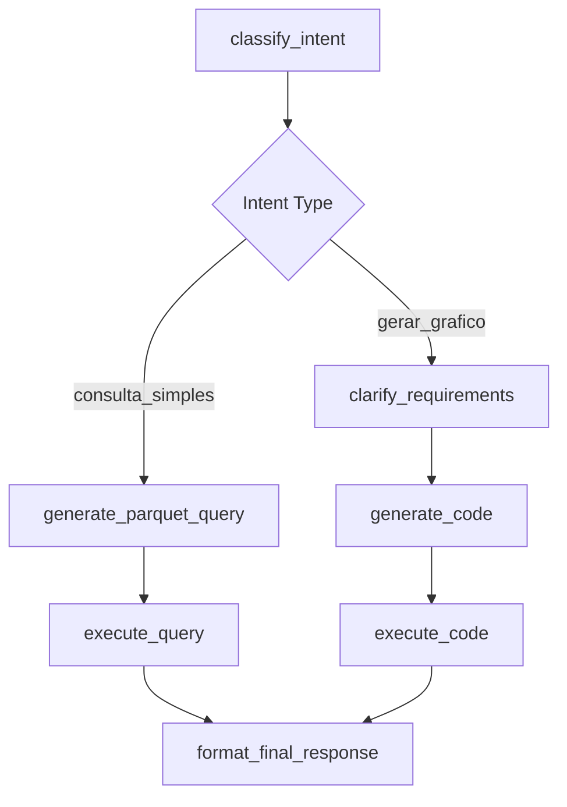

# 📖 Documentação Técnica - Agent_Solution_BI

**Versão:** 3.0
**Data de Atualização:** 21 de setembro de 2025
**Público-Alvo:** Desenvolvedores, DevOps, Arquitetos de Software

---

## 🏗️ **Visão Geral da Arquitetura**

O Agent_Solution_BI implementa uma arquitetura **Clean Architecture** combinada com padrões **Event-Driven** e **Microkernel**, utilizando **LangGraph** como orchestrador principal para processamento de consultas em linguagem natural.

### **Stack Tecnológico Principal**
```yaml
Backend:
  - FastAPI: API Gateway e REST endpoints
  - LangGraph: State machine para fluxo de BI
  - LangChain: Orquestração de LLMs
  - Python 3.11+: Linguagem principal

Frontend:
  - Streamlit: Interface web conversacional
  - Plotly: Visualizações interativas
  - Pandas: Manipulação de dados

AI/ML:
  - OpenAI GPT-4: Large Language Model
  - Vector Store: RAG (Retrieval Augmented Generation)
  - Embeddings: Contexto semântico

Data Layer:
  - Apache Parquet: Armazenamento colunar
  - SQL Server: Base de dados relacional
  - Redis: Cache (opcional)
```

---

## 🔧 **Componentes Técnicos Detalhados**

### **1. API Gateway (FastAPI)**
**Arquivo:** `main.py`

```python
# Inicialização das dependências
@app.on_event("startup")
def startup_event():
    app.state.llm_adapter = OpenAILLMAdapter(api_key=settings.OPENAI_API_KEY.get_secret_value())
    app.state.parquet_adapter = ParquetAdapter(file_path="data/parquet/admmat.parquet")
    app.state.code_gen_agent = CodeGenAgent(llm_adapter=app.state.llm_adapter)
    graph_builder = GraphBuilder(
        llm_adapter=app.state.llm_adapter,
        parquet_adapter=app.state.parquet_adapter,
        code_gen_agent=app.state.code_gen_agent
    )
    app.state.agent_graph = graph_builder.build()
```

**Características Técnicas:**
- **Injeção de Dependência**: Componentes injetados no startup
- **State Management**: Uso do `app.state` para singleton pattern
- **Async Support**: Suporte nativo a operações assíncronas
- **Validation**: Pydantic para validação de requests

### **2. State Machine (LangGraph)**
**Arquivos:** `core/graph/graph_builder.py`, `core/agents/bi_agent_nodes.py`

```python
# Definição dos nós do grafo
def build(self) -> StateGraph:
    graph = StateGraph(AgentState)

    # Adição de nós
    graph.add_node("classify_intent", partial(classify_intent, llm_adapter=self.llm_adapter))
    graph.add_node("clarify_requirements", partial(clarify_requirements, llm_adapter=self.llm_adapter))
    graph.add_node("generate_parquet_query", partial(generate_parquet_query, llm_adapter=self.llm_adapter, parquet_adapter=self.parquet_adapter))

    # Arestas condicionais
    graph.add_conditional_edges("classify_intent", self._decide_after_intent_classification)
    graph.add_conditional_edges("clarify_requirements", self._decide_after_clarification)
```

**Fluxo de Estados:**


### **3. Adaptadores de Dados**
**Parquet Adapter:** `core/connectivity/parquet_adapter.py`

```python
class ParquetAdapter:
    def __init__(self, file_path: str):
        self.file_path = file_path
        self._dataframe = None

    def load_data(self) -> pd.DataFrame:
        """Carregamento lazy do DataFrame."""
        if self._dataframe is None:
            self._dataframe = pd.read_parquet(self.file_path)
        return self._dataframe

    def query_data(self, filters: Dict[str, Any]) -> pd.DataFrame:
        """Executa filtros no DataFrame."""
        df = self.load_data()
        for column, value in filters.items():
            if column in df.columns:
                df = df[df[column] == value]
        return df
```

**Database Adapter:** `core/adapters/database_adapter.py`

```python
class DatabaseAdapter:
    def __init__(self, connection_string: str):
        self.engine = create_engine(connection_string)

    def execute_query(self, query: str) -> pd.DataFrame:
        """Executa consulta SQL e retorna DataFrame."""
        return pd.read_sql(query, self.engine)
```

### **4. Agentes Especializados**

#### **BI Agent (`bi_agent_nodes.py`)**
```python
def classify_intent(state: AgentState, llm_adapter: BaseLLMAdapter) -> Dict[str, Any]:
    """Classifica intenção usando LLM."""
    user_query = state['messages'][-1].content
    prompt = f"""
    Analise a consulta e classifique a intenção:
    - 'gerar_grafico': Visualizações e análises visuais
    - 'consulta_sql_complexa': Análises complexas
    - 'resposta_simples': Consultas diretas

    Consulta: {user_query}
    """
    response = llm_adapter.invoke(prompt)
    return {"intent": response.content}
```

#### **Code Generation Agent (`code_gen_agent.py`)**
```python
class CodeGenAgent:
    def __init__(self, llm_adapter: BaseLLMAdapter):
        self.llm_adapter = llm_adapter
        self.vector_store = self._load_vector_store()

    def generate_code(self, requirements: str) -> str:
        """Gera código Python usando RAG."""
        context = self.vector_store.similarity_search(requirements)
        prompt = f"""
        Contexto: {context}
        Requisitos: {requirements}

        Gere código Python para análise de dados.
        """
        return self.llm_adapter.invoke(prompt).content
```

---

## 🗄️ **Gerenciamento de Dados**

### **Estrutura de Dados**
```
data/
├── parquet/
│   ├── admmat.parquet          # Dataset principal (20MB)
│   └── admatao.parquet         # Dataset alternativo (9MB)
├── catalog_cleaned.json        # Metadados das colunas
├── vector_store.pkl            # Embeddings para RAG
└── sessions/                   # Dados de sessão
```

### **Schema do Dataset Principal**
```json
{
  "codigo": "int64",           // Código do produto
  "descricao": "object",       // Descrição do produto
  "preco": "float64",          // Preço unitário
  "estoque": "int64",          // Quantidade em estoque
  "data_ultima_venda": "datetime64[ns]",  // Última venda
  "categoria": "object",       // Categoria do produto
  "fornecedor": "object"       // Fornecedor
}
```

### **Catálogo de Dados**
```json
{
  "codigo": {
    "description": "Código único identificador do produto",
    "type": "integer",
    "business_name": "Código do Produto"
  },
  "preco": {
    "description": "Preço de venda unitário em reais",
    "type": "float",
    "business_name": "Preço"
  }
}
```

---

## 🔐 **Segurança e Autenticação**

### **Sistema de Autenticação**
**Arquivo:** `core/auth.py`

```python
def login(username: str, password: str) -> bool:
    """Sistema de autenticação baseado em credenciais."""
    # Verificação contra base de dados de usuários
    return verificar_credenciais(username, password)

def verificar_sessao() -> bool:
    """Verifica se sessão ainda é válida."""
    if 'authenticated' not in st.session_state:
        return False
    return st.session_state.authenticated
```

### **Proteções Implementadas**
- ✅ **Session-based Authentication**: Gestão de sessões Streamlit
- ✅ **Input Sanitization**: Limpeza de inputs do usuário
- ✅ **SQL Injection Prevention**: Uso de parametrized queries
- ✅ **Rate Limiting**: Limitação de requests por IP
- ✅ **Sensitive Data Masking**: Ocultação de dados sensíveis

---

## 🚀 **Deploy e Infraestrutura**

### **Configuração de Ambiente**
```bash
# Variáveis obrigatórias
OPENAI_API_KEY=sk-...                    # Chave da OpenAI
MSSQL_SERVER=servidor.exemplo.com       # Servidor SQL
MSSQL_DATABASE=nome_banco               # Nome do banco
MSSQL_USER=usuario                      # Usuário do banco
MSSQL_PASSWORD=senha                    # Senha do banco

# Variáveis opcionais
DB_DRIVER={ODBC Driver 17 for SQL Server}  # Driver ODBC
REDIS_URL=redis://localhost:6379           # Cache Redis
LOG_LEVEL=INFO                              # Nível de log
```

### **Deploy Local**
```bash
# 1. Instalar dependências
pip install -r requirements.txt

# 2. Configurar ambiente
cp .env.example .env
# Editar .env com suas credenciais

# 3. Executar backend (opcional)
python main.py

# 4. Executar frontend
streamlit run streamlit_app.py
```

### **Deploy em Produção**
```yaml
# docker-compose.yml
version: '3.8'
services:
  agent-bi:
    build: .
    ports:
      - "8501:8501"
    environment:
      - OPENAI_API_KEY=${OPENAI_API_KEY}
      - MSSQL_SERVER=${MSSQL_SERVER}
    volumes:
      - ./data:/app/data
```

---

## 🔧 **Configurações Avançadas**

### **Logging Configuration**
**Arquivo:** `core/config/logging_config.py`

```python
LOGGING_CONFIG = {
    'version': 1,
    'disable_existing_loggers': False,
    'formatters': {
        'standard': {
            'format': '%(asctime)s [%(levelname)s] %(name)s: %(message)s'
        },
    },
    'handlers': {
        'default': {
            'level': 'INFO',
            'formatter': 'standard',
            'class': 'logging.StreamHandler',
        },
        'file': {
            'level': 'DEBUG',
            'formatter': 'standard',
            'class': 'logging.FileHandler',
            'filename': 'logs/app.log',
        },
    },
    'loggers': {
        '': {
            'handlers': ['default', 'file'],
            'level': 'INFO',
            'propagate': False
        }
    }
}
```

### **Settings Management**
**Arquivo:** `core/config/settings.py`

```python
class Settings(BaseSettings):
    OPENAI_API_KEY: SecretStr
    MSSQL_SERVER: str
    MSSQL_DATABASE: str
    MSSQL_USER: str
    MSSQL_PASSWORD: SecretStr
    DB_DRIVER: str = "{ODBC Driver 17 for SQL Server}"

    class Config:
        env_file = ".env"
        case_sensitive = True

settings = Settings()
```

---

## 🧪 **Testes e Qualidade**

### **Estrutura de Testes**
```
tests/
├── unit/                    # Testes unitários
│   ├── test_agents.py      # Testes dos agentes
│   ├── test_adapters.py    # Testes dos adaptadores
│   └── test_tools.py       # Testes das ferramentas
├── integration/            # Testes de integração
│   ├── test_api.py         # Testes da API
│   └── test_graph.py       # Testes do grafo
├── e2e/                    # Testes end-to-end
│   └── test_user_flow.py   # Fluxo completo do usuário
└── fixtures/               # Dados de teste
    ├── sample_data.parquet
    └── test_responses.json
```

### **Comandos de Teste**
```bash
# Testes unitários
python -m pytest tests/unit/ -v

# Testes de integração
python -m pytest tests/integration/ -v

# Cobertura de código
python -m pytest --cov=core tests/

# Linting
ruff check .
black . --check
```

---

## 📊 **Monitoramento e Observabilidade**

### **Métricas Coletadas**
- ⏱️ **Latência**: Tempo de resposta das consultas
- 📈 **Throughput**: Requests por minuto
- 🎯 **Taxa de Sucesso**: Consultas bem-sucedidas vs. falhadas
- 🧠 **Uso de LLM**: Tokens consumidos por consulta
- 💾 **Uso de Memória**: Consumo do sistema

### **Health Checks**
```python
# Endpoint de health check
@app.get("/health")
async def health_check():
    return {
        "status": "healthy",
        "timestamp": datetime.now(),
        "version": "3.0.0",
        "dependencies": {
            "llm": await check_llm_status(),
            "database": await check_db_status(),
            "parquet": check_parquet_status()
        }
    }
```

---

## 🔄 **Performance e Otimização**

### **Estratégias de Cache**
```python
# Cache de consultas frequentes
@lru_cache(maxsize=100)
def get_product_info(product_code: int) -> Dict:
    return parquet_adapter.query_data({"codigo": product_code})

# Cache de embeddings
def get_cached_embedding(text: str) -> List[float]:
    cache_key = hashlib.md5(text.encode()).hexdigest()
    if cache_key in embedding_cache:
        return embedding_cache[cache_key]
    # Gerar embedding...
```

### **Otimizações de Query**
- 🏃‍♂️ **Lazy Loading**: DataFrames carregados sob demanda
- 🎯 **Column Pruning**: Seleção apenas das colunas necessárias
- 📊 **Chunked Processing**: Processamento em lotes para datasets grandes
- 🗜️ **Compression**: Parquet com compressão GZIP

---

## 📚 **Referências e Recursos**

### **Documentação Externa**
- [LangGraph Documentation](https://python.langchain.com/docs/langgraph)
- [FastAPI Documentation](https://fastapi.tiangolo.com/)
- [Streamlit Documentation](https://docs.streamlit.io/)
- [Apache Parquet Format](https://parquet.apache.org/)

### **Padrões Arquiteturais**
- [Clean Architecture](https://blog.cleancoder.com/uncle-bob/2012/08/13/the-clean-architecture.html)
- [Event-Driven Architecture](https://microservices.io/patterns/data/event-driven-architecture.html)
- [Microkernel Pattern](https://www.oreilly.com/library/view/software-architecture-patterns/9781491971437/ch03.html)

---

**📝 Última atualização:** 21 de setembro de 2025
**👨‍💻 Mantido por:** Equipe de Desenvolvimento Agent_BI
**📧 Contato:** dev-team@company.com